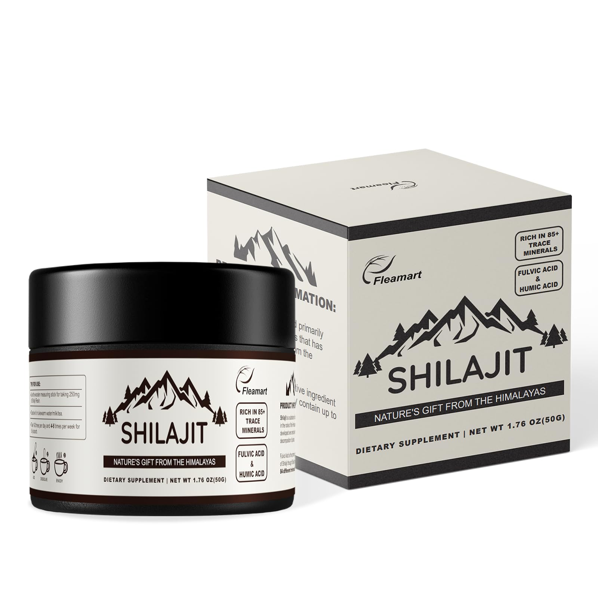
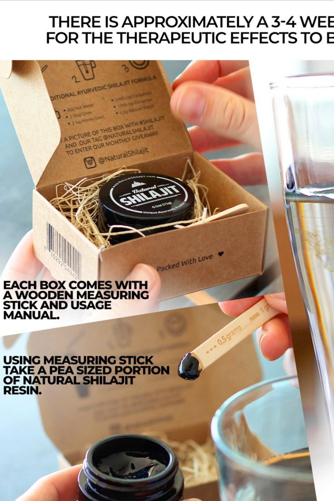
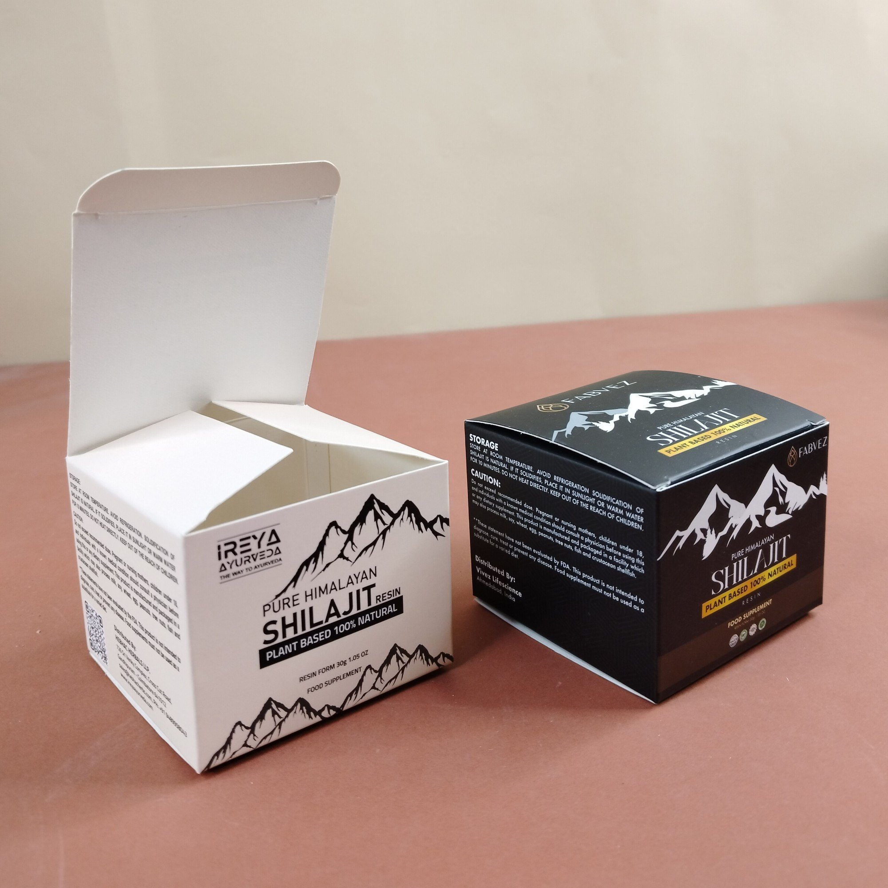
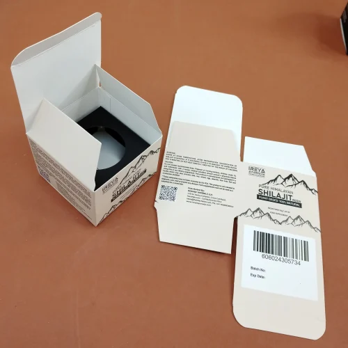

# Shilajit Packaging Design Guidelines

## Project Overview
We are designing an **elegant and premium box** for our **Shilajit brand \"کوہِ نور شلاجیت\"**. The box dimensions will be **1x1 inch** and will feature high-quality graphics, natural themes, and a luxurious finish. This document provides detailed guidelines for the content and design of the box.

---

## Design Philosophy
The box design should reflect:
- **Luxury**: A sophisticated and royal appearance.
- **Nature**: Elements that evoke purity and authenticity.
- **Minimalism**: Clean and uncluttered layout.

### Suggested Color Schemes
1. **Black and Gold**: Represents power, purity, and exclusivity.
2. **Emerald Green and Silver**: Evokes natural elements and a refreshing vibe.
3. **Deep Brown and Bronze**: Symbolizes organic and earthy tones.

### Typography
- Use **elegant serif fonts** for Urdu and English headlines.
- Supporting text can use clean, modern sans-serif fonts.
- Maintain clear hierarchy and readability.

---

## Box Content (5 Visible Sides)

### 1. **Front Side**
- **Logo**: Centered at the top (e.g., "کوہِ نور سلاجیت").
- **Product Name**: Prominent, bold text:
  ```
  kohinoor Shilajit - کوہِ نور سلاجیت
  ```
- **Tagline**: Below the name:
  ```
  Pure Energy from the Heart of the Himalayas
  ```
- **Visual Element**: Abstract mountain graphic or gold line art.
- **Net Weight**: Small text at the bottom:
  ```
  20g – 100% Pure
  ```

### 2. **Back Side**
- **Description** (Urdu and English):
  ```
  کوہِ نور شلاجیت آپ کو خالص قدرتی طاقت فراہم کرتا ہے جو جسمانی اور ذہنی صحت کو بڑھاتا ہے۔

  Extracted from the depths of the Himalayas, our Shilajit is a powerful natural remedy that promotes energy, vitality, and overall well-being.
  ```
- **Ingredients**:
  ```
  100% Pure Himalayan Shilajit
  ```
- **Storage Instructions**:
  ```
  Store in a cool, dry place.
  ```

### 3. **Left Side**
- **How to Use**:
  ```
  1. Dissolve a pea-sized portion in warm water or milk.
  2. Consume once daily for best results.
  ```
- **Warning**:
  ```
  Not suitable for pregnant women or individuals under 18 years. Consult your physician before use.
  ```

### 4. **Right Side**
- **Certifications**: Use symbols/icons:
  - 100% Pure
  - Lab Tested
  - Eco-Friendly
- **Contact Info**:
  ```
  Distributed by Take It Man
  Website: www.takeitman.com
  Phone: +92-XXX-XXXXXXX
  ```
- **QR Code**: Link to website or product details.

### 5. **Top Side**
- **Tagline**: Centered:
  ```
  Pure Energy, Pure Life
  ```
- **Visual Element**: Minimal mountain line art or floral border.

---

## Printing Specifications
1. **Material**: Use premium cardstock or kraft paper.
2. **Finish**:
   - Matte finish for the base.
   - Embossed or foil-stamped text/logo.
3. **File Requirements**:
   - Vector formats: AI, EPS, or high-res PDF.

---

## Next Steps
1. **Finalize Content**:
   - Confirm Urdu/English text and any additional certifications.
2. **Hire Designer**:
   - Work with a professional designer on platforms like Fiverr or Upwork.
   - Share this document with them for guidance.
3. **Create a Mockup**:
   - Use 3D tools like [Placeit](https://placeit.net/) to visualize the design.
4. **Print and Test**:
   - Work with a printing vendor to create prototypes and test the final look.

## Reference Designs





---

## Notes
Design should ensures a balance of traditional authenticity and modern luxury, catering to customers who value premium natural products.

### Disclaimer  
Some images included in this repository are used solely for **design reference purposes** and may be subject to copyright by their respective owners. These images are not our original creations, and all rights remain with the original image owners. If you are the copyright owner and wish for your image to be removed, please contact us.

